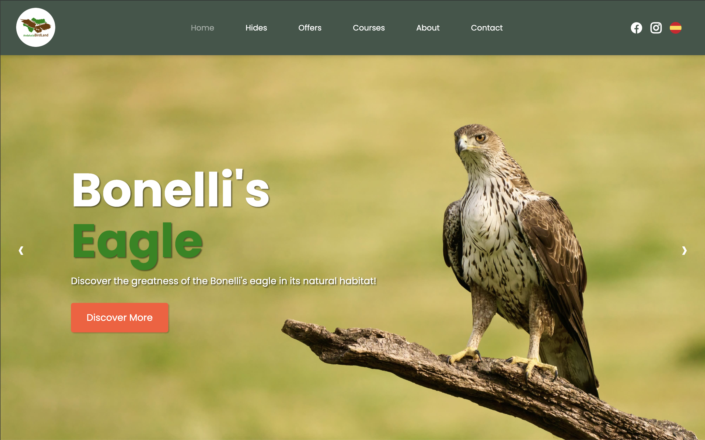
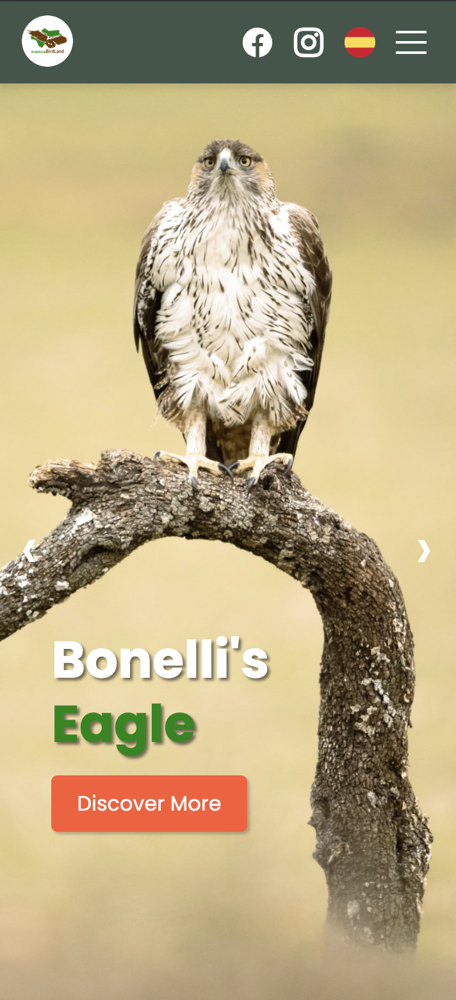

# Andalucía BirdLand – Ecotourism Website

**Type:** Website Design & Development  
**Role:** Designer & Frontend Developer  
**Stack:** HTML, CSS, JavaScript, Mister Plan Integration

**Description:**  
I designed and developed Andalucía BirdLand, a fully responsive ecotourism website showcasing nature photography hides and photography courses in Andalusia, Spain. The site features real-time booking and secure payment integration via Mister Plan. Optimized for SEO, accessibility, and fast performance, it delivers a seamless user experience across all devices—from desktops to smartphones.

**Key Contributions:**  
- **UI/UX Design:** Crafted clean, user-friendly, and visually appealing layouts tailored for all screen sizes.  
- **Frontend Development:** Hand-coded responsive HTML, CSS, and JavaScript to ensure smooth interactions and adaptability.  
- **Booking Integration:** Integrated Mister Plan API for real-time booking and payment processing.  
- **Performance & SEO:** Optimized load times, semantic HTML, and accessibility compliance for better reach and usability.

**Screenshots:**  

<figure>
  
  <figcaption><em>Desktop view</em></figcaption>
</figure>

*Tablet view*

*Mobile view*

**Live Demo:**  
Visit [andaluciabirdland.com](https://www.andaluciabirdland.com)

**Source Code:**  
Private GitHub repository — available upon request.
